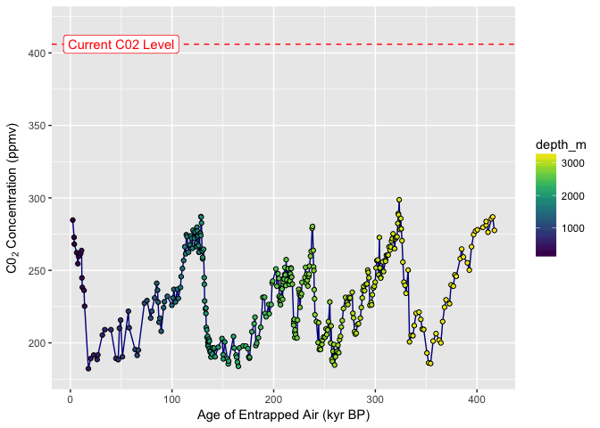
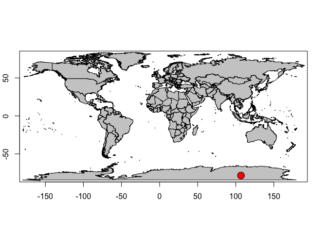

# Ice CO2 Record
Ryan Peek  
Updated: `r format(Sys.Date())`  


## Historical C0~2~ Record from Vostok Ice Cores 

How do we know the C0~2~ levels are higher now than compared with natural cycles observed through time? Thankfully we have ice cores that date back over 400,000 years ago. By analyzing the tiny bubbles trapped for eons deep (*cores have been drilled as deep as 3,623 m!*) within the ice at known points in time (based on the depth of the ice layer), it's possible to reconstruct a record of C0~2~ on Earth over a very long period of time.

These data are publically available as a simple text file [here](http://cdiac.ornl.gov/ftp/trends/co2/vostok.icecore.co2), and a full description of the metadata is [here](http://cdiac.ornl.gov/trends/co2/vostok.html).

Let's download and take a look!


```r
library(readr)
df <- read_tsv(file = "http://cdiac.ornl.gov/ftp/trends/co2/vostok.icecore.co2", skip = 20, col_names = c("depth_m","ice_age_yr_BP", "air_age_yr_BP", "C02_conc_ppmv"))
```

```
## Parsed with column specification:
## cols(
##   depth_m = col_double(),
##   ice_age_yr_BP = col_integer(),
##   air_age_yr_BP = col_integer(),
##   C02_conc_ppmv = col_double()
## )
```

### Making a Nice `ggplot`

If we want to make a basic plot, we can use the following code to simply show the data as is. It works, but compare with code for `ggplot`.


```r
# baseplot
with(df, plot(x=air_age_yr_BP/1000, y=C02_conc_ppmv, type = "l", col="darkblue", ylab=expression(paste("C0"[2]," Concentration (ppmv)"), sep=""), xlab="Age of Entrapped Air (kyr BP)", main="C02 through Time: Vostok Ice Core Data", ylim=c(180, 420)))
with(df, points(x=air_age_yr_BP/1000, y=C02_conc_ppmv, xlab=NULL, ylab=NULL, pch=21, col="gray50", bg="skyblue2"))
with(df, points(x=0, y=406, pch=16, col="red", cex=1.7))
text(x=0, y = 406, labels = "C02 Level \n on Jan 31, 2017!",font = 4, col = "maroon", pos = 4)
```

<!-- -->

Here's a **ggplot** version, notice the differences.


```r
library(ggplot2)
library(dplyr)
```

```
## 
## Attaching package: 'dplyr'
```

```
## The following objects are masked from 'package:stats':
## 
##     filter, lag
```

```
## The following object is masked from '.env':
## 
##     n
```

```
## The following objects are masked from 'package:base':
## 
##     intersect, setdiff, setequal, union
```

```r
library(viridis) # for nice color scheme

ggplot() + geom_line(data=df, aes(x=air_age_yr_BP/1000, y=C02_conc_ppmv), color="darkblue") + 
  geom_point(data=df, aes(x=air_age_yr_BP/1000, y=C02_conc_ppmv, fill=depth_m), pch=21) + scale_fill_viridis() +
  scale_y_continuous(limits = c(180, 420)) +
  labs(x="Age of Entrapped Air (kyr BP)", y=expression(paste(C0[2]," Concentration (ppmv)", sep=""))) +
  #geom_smooth(data=df, aes(x=air_age_yr_BP/1000, y=C02_conc_ppmv)) +
    geom_hline(yintercept=406, col="red", lty=2) + geom_label(data=NULL, aes(x=20, y=406, label="Current C02 Level"), col="red", nudge_x = 30)
```

<!-- -->


### Map Where This Is

**Vostok, Antarctica**
**-78.4645° S, 106.8340° E** 
**3488 m above MSL**


```r
library(maps)
library(mapdata)
library(measurements)

# change the degree symbol to a space
xlat <- gsub('°', '','-78.4645°')
xlon <- gsub('°', '','106.8340°')

ice<-data.frame("x"=as.numeric(xlon), "y"=as.numeric(xlat))

# convert from decimal deg to deg_minute_second
#xlat <- measurements::conv_unit(xlat, from = 'dec_deg', to = 'deg_min_sec')
#xlon <- measurements::conv_unit(xlon, from = 'dec_deg', to = 'deg_min_sec')

map.where(database = "world", x=ice$x, y=ice$y, col="red", add=TRUE)
```

```
## [1] "Antarctica"
```

```r
#map(database = "world", projection = "albers", par=c(-30,-40), plot=TRUE)

map(database = "world", plot=TRUE, fill = TRUE, col="gray80")
map.axes()
points(x = ice$x, y = ice$y, pch=21, bg="red", cex=2)
```

<!-- -->

## What About Today?

A good site to check the current C0~2~ emission level is [here](https://www.co2.earth/). NOAA's [site](https://www.esrl.noaa.gov/gmd/ccgg/trends/monthly.html) provides trends across different time stamps, dating back to **1959** using the Mauna Loa Observatory measurents.

Let's pull the annual measurements using the same commands we used above.


```r
library(readr)
library(viridis)

df2 <- read.table(file = "ftp://aftp.cmdl.noaa.gov/products/trends/co2/co2_mm_mlo.txt", col.names = c("year", "mon", "dec_date", "avg_C02", "interpolated_C02", "trend_seas_corr", "no_days"))

# filter to annual and get rid of missing/NAs
library(dplyr)
df_ann <- df2 %>% 
  filter(avg_C02 > 0) %>% 
  group_by(year) %>% 
  summarize(ann_C02=mean(avg_C02, na.rm=T))

# plot
ggplot() + geom_line(data=df_ann, aes(x=year, y=ann_C02), color="darkblue") + 
  labs(x="Year", y=expression(paste(C0[2]," Concentration (ppmv)", sep=""))) +
  geom_smooth(data=df_ann, aes(x=year, y=ann_C02)) +
  geom_point(data=df_ann, aes(x=year, y=ann_C02, fill=ann_C02), pch=21, cex=2.5, alpha=0.8) + scale_fill_viridis() +
    geom_hline(yintercept=406, col="red", lty=2) + geom_label(data=NULL, aes(x=1970, y=406, label="Current C02 Level"), col="red", nudge_x = 30)  +
  scale_x_continuous(breaks = seq(1955,2017,5), labels = seq(1955,2017,5)) + ggtitle("C02 At Mauna Loa Since 1958")
```

```
## `geom_smooth()` using method = 'loess'
```

<!-- -->
