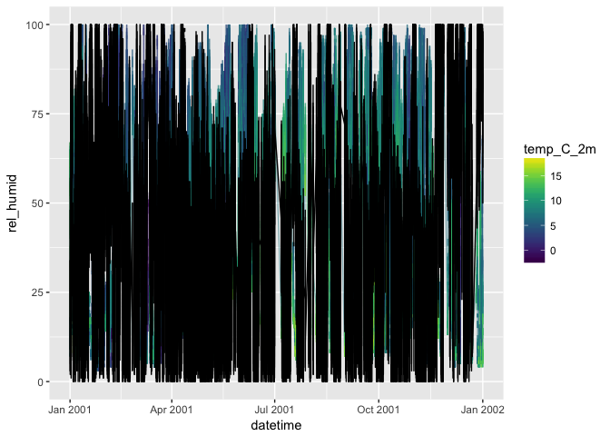

Time Series Data: CO2, Meterological, Etc
================
Ryan Peek
Updated: 2017-02-13

Historical C0<sub>2</sub> Record from Vostok Ice Cores
------------------------------------------------------

How do we know the C0<sub>2</sub> levels are higher now than compared with natural cycles observed through time? Thankfully we have ice cores that date back over 400,000 years ago. By analyzing the tiny bubbles trapped for eons deep (*cores have been drilled as deep as 3,623 m!*) within the ice at known points in time (based on the depth of the ice layer), it's possible to reconstruct a record of C0<sub>2</sub> on Earth over a very long period of time.

These data are publically available as a simple text file [here](http://cdiac.ornl.gov/ftp/trends/co2/vostok.icecore.co2), and a full description of the metadata is [here](http://cdiac.ornl.gov/trends/co2/vostok.html).

Let's download and take a look!

``` r
library(readr)
df <- read_tsv(file = "http://cdiac.ornl.gov/ftp/trends/co2/vostok.icecore.co2", skip = 20, col_names = c("depth_m","ice_age_yr_BP", "air_age_yr_BP", "C02_conc_ppmv"))
```

    ## Parsed with column specification:
    ## cols(
    ##   depth_m = col_double(),
    ##   ice_age_yr_BP = col_integer(),
    ##   air_age_yr_BP = col_integer(),
    ##   C02_conc_ppmv = col_double()
    ## )

### Making a Nice `ggplot`

If we want to make a basic plot, we can use the following code to simply show the data as is. It works, but compare with code for `ggplot`.

``` r
# baseplot
with(df, plot(x=air_age_yr_BP/1000, y=C02_conc_ppmv,
              type = "l", col="darkblue", 
              ylab=expression(paste("C0"[2]," Concentration (ppmv)"), sep=""),
              xlab="Age of Entrapped Air (kyr BP)", 
              main="C02 through Time: Vostok Ice Core Data", ylim=c(180, 420)))
with(df, points(x=air_age_yr_BP/1000, y=C02_conc_ppmv, 
                xlab=NULL, ylab=NULL, pch=21, col="gray50", bg="skyblue2"))
with(df, points(x=0, y=406, pch=16, col="red", cex=1.7))
text(x=0, y = 406, labels = "C02 Level \n on Jan 31, 2017!",
     font = 4, col = "maroon", pos = 4)
```


Here's a **ggplot** version, notice the differences.

``` r
library(ggplot2)
library(dplyr)
```

    ## 
    ## Attaching package: 'dplyr'

    ## The following objects are masked from 'package:stats':
    ## 
    ##     filter, lag

    ## The following object is masked from '.env':
    ## 
    ##     n

    ## The following objects are masked from 'package:base':
    ## 
    ##     intersect, setdiff, setequal, union

``` r
library(viridis) # for nice color scheme

ggplot() + geom_line(data=df, aes(x=air_age_yr_BP/1000, y=C02_conc_ppmv),
                     color="gray20") + 
  geom_point(data=df, aes(x=air_age_yr_BP/1000, y=C02_conc_ppmv, fill=depth_m), pch=21) +
  scale_fill_viridis() +
  scale_y_continuous(limits = c(180, 420)) +
  labs(x="Age of Entrapped Air (kyr BP)", y=expression(paste(C0[2]," Concentration (ppmv)", sep=""))) +
  #geom_smooth(data=df, aes(x=air_age_yr_BP/1000, y=C02_conc_ppmv)) +
  geom_hline(yintercept=406, col="red", lty=2) + 
  geom_label(data=NULL, aes(x=20, y=406, label="Current C02 Level"), 
             col="red", nudge_x = 30) + theme_bw()
```


### Map Where This Is

**Vostok, Antarctica** **-78.4645° S, 106.8340° E** **3488 m above MSL**

``` r
library(maps)
library(mapdata)
library(measurements)

# change the degree symbol to a space
xlat <- gsub('°', '','-78.4645°')
xlon <- gsub('°', '','106.8340°')

ice<-data.frame("x"=as.numeric(xlon), "y"=as.numeric(xlat))

# convert from decimal deg to deg_minute_second
#xlat <- measurements::conv_unit(xlat, from = 'dec_deg', to = 'deg_min_sec')
#xlon <- measurements::conv_unit(xlon, from = 'dec_deg', to = 'deg_min_sec')

map.where(database = "world", x=ice$x, y=ice$y, col="red", add=TRUE)
```

    ## [1] "Antarctica"

``` r
#map(database = "world", projection = "albers", par=c(-30,-40), plot=TRUE)

map(database = "world", plot=TRUE, fill = TRUE, col="gray80")
map.axes()
points(x = ice$x, y = ice$y, pch=21, bg="red", cex=2)
title(main = "Vostok, Antartica", sub = "Location of ice core data")
```


What About C0<sub>2</sub> Today?
--------------------------------

A good site to check the current C0<sub>2</sub> emission level is [here](https://www.co2.earth/). NOAA's [site](https://www.esrl.noaa.gov/gmd/ccgg/trends/monthly.html) provides trends across different time stamps, dating back to **1959** using the Mauna Loa Observatory measurents.

Let's pull the annual measurements using the same commands we used above.

``` r
library(readr)
library(viridis)

df2 <- read.table(file = "ftp://aftp.cmdl.noaa.gov/products/trends/co2/co2_mm_mlo.txt", col.names = c("year", "mon", "dec_date", "avg_C02", "interpolated_C02", "trend_seas_corr", "no_days"))

# filter to annual and get rid of missing/NAs
library(dplyr)
df_ann <- df2 %>% 
  filter(avg_C02 > 0) %>% 
  group_by(year) %>% 
  summarize(ann_C02=mean(avg_C02, na.rm=T))

# plot
ggplot() + geom_line(data=df_ann, aes(x=year, y=ann_C02), color="darkblue") + 
  labs(x="Year", y=expression(paste(C0[2]," Concentration (ppmv)", sep=""))) +
  geom_smooth(data=df_ann, aes(x=year, y=ann_C02)) +
  geom_point(data=df_ann, aes(x=year, y=ann_C02, fill=ann_C02), pch=21, cex=2.5, alpha=0.8) + scale_fill_viridis() +
    geom_hline(yintercept=406, col="red", lty=2) + geom_label(data=NULL, aes(x=1970, y=406, label="Current C02 Level"), col="red", nudge_x = 30)  +
  scale_x_continuous(breaks = seq(1955,2017,5), labels = seq(1955,2017,5)) + ggtitle("C02 At Mauna Loa Since 1958")
```

    ## `geom_smooth()` using method = 'loess'


Fine Scale Meterological Data
-----------------------------

There's an abundance of meterological data available for download now, but since we are still thinking about C0<sub>2</sub>, let's pull some fine-scale meterological data from the Mauna Loa station. This is met data collected every **minute** for a whole year.

Metadata for this is [here](ftp://aftp.cmdl.noaa.gov/data/meteorology/in-situ/README). Data used in this example is [here (minute scale met data)](ftp://aftp.cmdl.noaa.gov/data/meteorology/in-situ/mlo/2001/)

To actually go download all these in one go, try using some UNIX/terminal code! This will most likely only work in OSX, but you should be able to install `wget` on most any platform. However, you don't have to do this, because this data is already available for download on github [here]()

``` r
# change directory to current dir
system("cd ~/Documents/github/teaching/wRangling_Lectures/data")

# get all files in a single dir
system("wget --no-verbose --no-parent --recursive --level=1 --no-directories ftp://aftp.cmdl.noaa.gov/data/meteorology/in-situ/mlo/2001/")
```

So we have 12 files, each a month worth of measurements taken every minute, which is roughly *(`44,000` measurements `*` `12` months)*, or about a half million lines of data. Give or take.

First step, how do we read in this many files at once and merge them?

### Read in [Multiple Files](http://serialmentor.com/blog/2016/6/13/reading-and-combining-many-tidy-data-files-in-R)

``` r
require(readr)  # for read_csv()
require(dplyr)  # for mutate()
require(tidyr)  # for unnest()
```

    ## Loading required package: tidyr

``` r
require(purrr)  # for map(), reduce()
```

    ## Loading required package: purrr

    ## 
    ## Attaching package: 'purrr'

    ## The following object is masked from 'package:maps':
    ## 
    ##     map

    ## The following objects are masked from 'package:dplyr':
    ## 
    ##     contains, order_by

``` r
folder <- "data/2001_mauna_loa_met_data"      
files_list <- dir(path = folder, pattern = "*.txt")

# simple version
data <- files_list %>%
  purrr::map(~read.table(file.path(folder, .), header = FALSE)) %>%    # read in all the files individually
  reduce(rbind)       # reduce with rbind into one dataframe 
colnames(data)<-c("siteID", "year", "month", "day", "hour24", "min", "windDir",   "windSpeed_m_s", "windSteady", "baro_hPa", "temp_C_2m", "temp_C_10m", "temp_C_towertop", "rel_humid", "precip_intens_mm_hr")  

head(data)
```

    ##   siteID year month day hour24 min windDir windSpeed_m_s windSteady
    ## 1    MLO 2001     1   1      0   0     340           3.4         -9
    ## 2    MLO 2001     1   1      0   1     334           2.8         -9
    ## 3    MLO 2001     1   1      0   2     314           3.3         -9
    ## 4    MLO 2001     1   1      0   3     323           2.4         -9
    ## 5    MLO 2001     1   1      0   4     349           0.4         -9
    ## 6    MLO 2001     1   1      0   5     345           1.8         -9
    ##   baro_hPa temp_C_2m temp_C_10m temp_C_towertop rel_humid
    ## 1   -999.9      12.7       11.2            10.2        53
    ## 2   -999.9      12.5       11.2            10.5        54
    ## 3   -999.9      12.5       11.2            10.5        54
    ## 4   -999.9      11.6       10.6            10.3        57
    ## 5   -999.9      11.2       10.8            10.4        57
    ## 6   -999.9      12.0       11.1            10.6        54
    ##   precip_intens_mm_hr
    ## 1                   0
    ## 2                   0
    ## 3                   0
    ## 4                   0
    ## 5                   0
    ## 6                   0

``` r
dim(data)
```

    ## [1] 459769     15

``` r
# add some more info
data <- data_frame(filename = files_list) %>% # create dataframe
  mutate(file_contents = map(filename, # read files into
                             ~read.table(file.path(folder, .), header = FALSE))) %>% 
  unnest
colnames(data)<-c("filename", "siteID", "year", "month", "day", "hour24", "min", "windDir",   "windSpeed_m_s", "windSteady", "baro_hPa", "temp_C_2m", "temp_C_10m", "temp_C_towertop", "rel_humid", "precip_intens_mm_hr")

dim(data)
```

    ## [1] 459769     16

Wow that's cool!

Okay, but now let's plot some of this insanity. First we need to get times into a format we can play with.

### Datetimes (aka Insanity)

First, please read:

-   this lesson on [dates & spreadsheets](http://www.datacarpentry.org/spreadsheet-ecology-lesson/03-dates-as-data.html)
-   <https://www.stat.berkeley.edu/~s133/dates.html>
-   <https://cran.r-project.org/web/packages/lubridate/vignettes/lubridate.html>
-   <http://www.noamross.net/blog/2014/2/10/using-times-and-dates-in-r---presentation-code.html>

Various commands and functions available:

**Dates** - `as.Date("2016-01-01")` = 2016-01-01 - `lubridate::ymd("2016-01-01")` or `lubridate::mdy` or `lubridate::dmy` = 2016-01-01

**Datetimes with Timezones** - `as.POSIXct("2016-01-01 12:00", "UTC")` = 2016-01-01 12:00:00 - `strptime("2016/01/01 12:00",format = "%Y/%m/%d %H:%M")` = 0, 0, 12, 1, 0, 116, 5, 0, 0, PST, NA - `lubridate::ymd_hms("2016/01/01 21:22:22")` = 2016-01-01 21:22:22 - `lubridate::ymd_hms("20160101 21:22:22")` = 2016-01-01 21:22:22 - `lubridate::ymd_hms("2016-01-01 21:22:22", tz = "America/Los_Angeles")` = 2016-01-01 21:22:22

**Datetimes without Timezones** using **`chron`** package - `chron::as.chron("2013-07-24 23:55:26")` = 1.591099710^{4} - `chron::as.chron("07/25/13 08:32:07", "%m/%d/%y %H:%M:%S")` = 1.591135610^{4}

``` r
library(lubridate)
```

    ## 
    ## Attaching package: 'lubridate'

    ## The following object is masked from 'package:base':
    ## 
    ##     date

``` r
data$datetime <- ymd_hm(paste0(data$year,"-", data$month, "-", data$day," ", data$hour24, ":", data$min))

summary(data)
```

    ##    filename         siteID            year          month       
    ##  Length:459769      MLO:459769   Min.   :2001   Min.   : 1.000  
    ##  Class :character                1st Qu.:2001   1st Qu.: 3.000  
    ##  Mode  :character                Median :2001   Median : 6.000  
    ##                                  Mean   :2001   Mean   : 6.474  
    ##                                  3rd Qu.:2001   3rd Qu.:10.000  
    ##                                  Max.   :2001   Max.   :12.000  
    ##       day            hour24           min           windDir      
    ##  Min.   : 1.00   Min.   : 0.00   Min.   : 0.00   Min.   :-999.0  
    ##  1st Qu.: 8.00   1st Qu.: 5.00   1st Qu.:15.00   1st Qu.: 115.0  
    ##  Median :15.00   Median :11.00   Median :30.00   Median : 156.0  
    ##  Mean   :15.44   Mean   :11.43   Mean   :29.51   Mean   : 144.5  
    ##  3rd Qu.:22.00   3rd Qu.:18.00   3rd Qu.:45.00   3rd Qu.: 236.0  
    ##  Max.   :31.00   Max.   :23.00   Max.   :59.00   Max.   : 360.0  
    ##  windSpeed_m_s       windSteady    baro_hPa        temp_C_2m       
    ##  Min.   :-99.900   Min.   :-9   Min.   :-999.9   Min.   :-999.900  
    ##  1st Qu.:  1.900   1st Qu.:-9   1st Qu.:-999.9   1st Qu.:   4.400  
    ##  Median :  3.500   Median :-9   Median :-999.9   Median :   6.900  
    ##  Mean   :  1.229   Mean   :-9   Mean   :-999.9   Mean   :   4.747  
    ##  3rd Qu.:  5.900   3rd Qu.:-9   3rd Qu.:-999.9   3rd Qu.:   9.400  
    ##  Max.   : 20.500   Max.   :-9   Max.   :-999.9   Max.   :  18.900  
    ##    temp_C_10m      temp_C_towertop      rel_humid      precip_intens_mm_hr
    ##  Min.   :-999.90   Min.   :-999.900   Min.   :-99.00   Min.   :-99.0000   
    ##  1st Qu.:   4.90   1st Qu.:   5.600   1st Qu.: 14.00   1st Qu.:  0.0000   
    ##  Median :   6.90   Median :   7.200   Median : 28.00   Median :  0.0000   
    ##  Mean   : -46.69   Mean   :   1.539   Mean   : 31.82   Mean   : -0.8066   
    ##  3rd Qu.:   8.60   3rd Qu.:   8.800   3rd Qu.: 57.00   3rd Qu.:  0.0000   
    ##  Max.   :  16.90   Max.   :  16.200   Max.   :138.00   Max.   : 60.0000   
    ##     datetime                  
    ##  Min.   :2001-01-01 00:00:00  
    ##  1st Qu.:2001-03-29 06:57:00  
    ##  Median :2001-06-24 06:13:00  
    ##  Mean   :2001-06-30 15:28:42  
    ##  3rd Qu.:2001-10-07 00:34:00  
    ##  Max.   :2001-12-31 23:59:00

``` r
# clean up the NA data (stuff = -99 or -999)
df <- data %>% 
  filter(!rel_humid == -99, 
         !temp_C_2m == -999,
         !windSpeed_m_s == -99.9)


library(ggplot2)

ggplot() + 
  geom_line(data=df, aes(x=datetime, y=rel_humid, color=temp_C_2m), alpha=0.5) + 
  geom_line(data=df, aes(x=datetime, y=windSpeed_m_s*10)) +
  viridis::scale_color_viridis() + ylim(0, 100)
```


