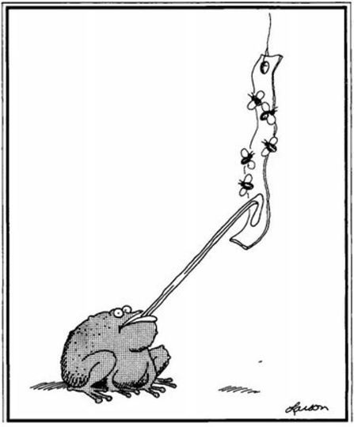

## Wrap up (with a *`reveal.js`* Presentation)

These presentations are pretty cool and easy to build in an Rmarkdown document 

- See the demo [here](http://lab.hakim.se/reveal-js/#/)
- And instructions [here](http://rmarkdown.rstudio.com/revealjs_presentation_format.html)

# So! What Did We Learn? 

## What Did We Learn

## Well...Maybe More

1. Hopefully something you'll end up using!
2. Remember the **PROCESS** not just the tools (tools change, process doesn't)
3. Important to stay organized, tidy!
4. Writing down/commenting on your process and code
 
# Tidy Data

## Tidy & Organized (means less time later!)

- We know what tidy data is
- Use that when collecting data to save time later

## Keep it Simple

- **Your future self will thank your current/past self**

# WHAT?! {data-background="https://m.popkey.co/d8fe77/8MX7l.gif"}

# Graphics {data-background=#440154}

## Graphics: Keep It Simple (sound familiar!?)

- Just because you can doesn't mean you should
- Keep it simple...see great demo from Jenny Bryan [here](http://stat545.com/img/less-is-more-darkhorse-analytics.gif)
- Great slide presentation from Karl Broman [here](https://www.biostat.wisc.edu/~kbroman/presentations/graphs2017.pdf)

# Practice is Use 

## If you want this to stick, keep at it!

# Gettin Help

## {data-background="http://www.animateit.net/data/media/110/edge_of_the_cliff.gif"}

## Stage I Help

- Use the `?`*function/package* and help in R!
- Google is your friend...add `+ R` or `+ R CRAN` to search error
- Look for vignettes for the package you are trying to use
- Loads of examples, blogs, etc:
    - [R-Bloggers](https://www.r-bloggers.com/)
    - [Stats Methods](http://www.statmethods.net/)
    - [R Stats](https://www.r-statistics.com/)
    - [RStudio](https://blog.rstudio.org/)
  
## Stage II Help

- Davis R Users Group [listserv!](http://d-rug.github.io/)
- Davis R Users Group Work Session...come in person!

## Stage III Help!

- Stack Overflow or other list 
- Make sure you have a reproducible example [**"reprex"**](http://jennybc.github.io/reprex/)!! 
    - see `dput()` to recreate a sample of your data frame
    - include error outputs and all code

# Thanks Everyone! {data-background="https://m.popkey.co/34c9ea/Ll6Wr.gif?c=popkey-web&p=popkey&i=sciencetech-ent&l=direct&f=.gif"}

