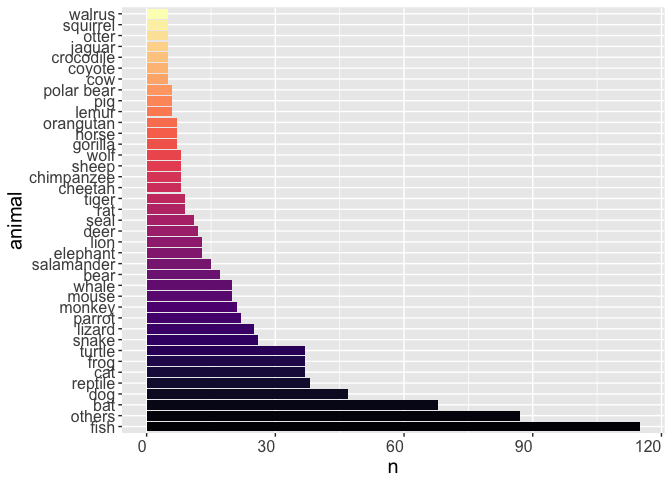

real live scientist animals
================
Ryan Peek
Updated: 2017-03-13

This is about Tweet Mining
--------------------------

But this is really cool. Taken pretty much verbatim from this fantastic blog: <http://www.masalmon.eu/2017/02/05/actuallivingscientists/>

Basically pull tweets based on a given hash tag, filter, and plot based on the most common animal folks mentioned.

``` r
library("rtweet")
library("dplyr", warn.conflicts = F)
actual <- search_tweets(q = "#actuallivingscientist",
                        include_rts = FALSE,
                        n = 18000, type = "recent")
save(actual, file = "data/tweet_actual_living_sci.rda")

# no need for coordinates which are often missing
actual <- select(actual, - coordinates)

# only English
actual <- filter(actual, lang == "en")

# no answers
actual <- filter(actual, is.na(in_reply_to_user_id))

# save
save(actual, file = "data/2017-02-07-actuallivingscientists.Rda")
```

``` r
library("dplyr", warn.conflicts = F)
load("data/2017-02-07-actuallivingscientists.Rda")

head(actual)
```

    ##     screen_name    user_id          created_at          status_id
    ## 1 anasghadouani 2424428378 2017-02-07 09:06:33 828892694789316608
    ## 2  PeterVanesse  948180632 2017-02-07 09:06:09 828892593819906048
    ## 3      HeaneyLM 3812637087 2017-02-07 09:03:52 828892022832500738
    ## 4     pilomatil   27939232 2017-02-07 09:03:38 828891960643559424
    ## 5     Nat_Mac26  281294186 2017-02-07 08:56:40 828890210851123201
    ## 6      liziwake   27404691 2017-02-07 08:47:50 828887986444103680
    ##                                                                                                                                           text
    ## 1  I am Anas #actuallivingscientist. I want to improve our understanding of #water resources for a better world for humans and the environment
    ## 2                     #actuallivingscientist in the Dutch newspapers. Nice to see a familiar face @annaliisalaine :-)\nhttps://t.co/zCiEqRrQsC
    ## 3                         I'm Liam and I'm an #actuallivingscientist researching biomarkers of cardiovascular disease using mass spectrometry.
    ## 4 Hi, I'm Pia! I am #actuallivingscientist studying the Amazon floodplains and help communicate science as Vice-Presi… https://t.co/ojW8YHYXds
    ## 5       This is precisely why I'm accepting DM applications for an #actuallivingscientist inspired calendar \U0001f60a https://t.co/xXn4wqKH6C
    ## 6  #actuallivingscientist is fascinating- so many different jobs. Out of a threat to their existence comes an insight… https://t.co/ukyqHrzyd6
    ##   retweet_count favorite_count is_quote_status    quote_status_id
    ## 1             0              0           FALSE               <NA>
    ## 2             1              1           FALSE               <NA>
    ## 3             0              0           FALSE               <NA>
    ## 4             1              0           FALSE               <NA>
    ## 5             0              0            TRUE 828756107359305728
    ## 6             0              0            TRUE 827541667163021312
    ##   is_retweet retweet_status_id in_reply_to_status_status_id
    ## 1      FALSE              <NA>                         <NA>
    ## 2      FALSE              <NA>                         <NA>
    ## 3      FALSE              <NA>                         <NA>
    ## 4      FALSE              <NA>                         <NA>
    ## 5      FALSE              <NA>                         <NA>
    ## 6      FALSE              <NA>                         <NA>
    ##   in_reply_to_status_user_id in_reply_to_status_screen_name lang
    ## 1                       <NA>                           <NA>   en
    ## 2                       <NA>                           <NA>   en
    ## 3                       <NA>                           <NA>   en
    ## 4                       <NA>                           <NA>   en
    ## 5                       <NA>                           <NA>   en
    ## 6                       <NA>                           <NA>   en
    ##                source media_id media_url media_url_expanded urls
    ## 1  Twitter Web Client     <NA>      <NA>               <NA> <NA>
    ## 2           TweetDeck     <NA>      <NA>               <NA> <NA>
    ## 3  Twitter for iPhone     <NA>      <NA>               <NA> <NA>
    ## 4  Twitter for iPhone     <NA>      <NA>               <NA> <NA>
    ## 5 Twitter for Android     <NA>      <NA>               <NA> <NA>
    ## 6  Twitter for iPhone     <NA>      <NA>               <NA> <NA>
    ##                  urls_display
    ## 1                        <NA>
    ## 2      nrc.nl/nieuws/2017/02…
    ## 3                        <NA>
    ## 4 twitter.com/i/web/status/8…
    ## 5 twitter.com/_wommack/statu…
    ## 6 twitter.com/i/web/status/8…
    ##                                                                        urls_expanded
    ## 1                                                                               <NA>
    ## 2 https://www.nrc.nl/nieuws/2017/02/06/maak-kennis-met-echte-wetenschappers-a1544745
    ## 3                                                                               <NA>
    ## 4                                https://twitter.com/i/web/status/828891960643559424
    ## 5                             https://twitter.com/_wommack/status/828756107359305728
    ## 6                                https://twitter.com/i/web/status/828887986444103680
    ##   mentions_screen_name mentions_user_id symbols
    ## 1                 <NA>             <NA>    <NA>
    ## 2       annaliisalaine        104266865    <NA>
    ## 3                 <NA>             <NA>    <NA>
    ## 4                 <NA>             <NA>    <NA>
    ## 5                 <NA>             <NA>    <NA>
    ## 6                 <NA>             <NA>    <NA>
    ##                      hashtags         place_id place_type place_name
    ## 1 actuallivingscientist water             <NA>       <NA>       <NA>
    ## 2       actuallivingscientist             <NA>       <NA>       <NA>
    ## 3       actuallivingscientist             <NA>       <NA>       <NA>
    ## 4       actuallivingscientist 3060d31f8bf75f53       city     Elsene
    ## 5       actuallivingscientist             <NA>       <NA>       <NA>
    ## 6       actuallivingscientist             <NA>       <NA>       <NA>
    ##   place_full_name country_code country
    ## 1            <NA>         <NA>    <NA>
    ## 2            <NA>         <NA>    <NA>
    ## 3            <NA>         <NA>    <NA>
    ## 4  Elsene, België           BE Belgium
    ## 5            <NA>         <NA>    <NA>
    ## 6            <NA>         <NA>    <NA>
    ##                                                            bounding_box_coordinates
    ## 1                                                                              <NA>
    ## 2                                                                              <NA>
    ## 3                                                                              <NA>
    ## 4 4.347341 4.4033873 4.4033873 4.347341 50.8007214 50.8007214 50.8406204 50.8406204
    ## 5                                                                              <NA>
    ## 6                                                                              <NA>
    ##   bounding_box_type
    ## 1              <NA>
    ## 2              <NA>
    ## 3              <NA>
    ## 4           Polygon
    ## 5              <NA>
    ## 6              <NA>

``` r
## Now ANIMALS

library("rcorpora")
head(corpora("animals/common")$animals)
```

    ## [1] "aardvark"  "alligator" "alpaca"    "antelope"  "ape"       "armadillo"

``` r
library("tidytext")
actual <- tibble::as_tibble(actual)
tidy_tweets <- bind_rows(actual %>% 
                           unnest_tokens(animal_for_detect, text),
                         actual %>% 
                           unnest_tokens(animal_for_detect, text, 
                                         token = "ngrams", n = 2))

tidy_tweets <- select(tidy_tweets, animal_for_detect, everything())
head(tidy_tweets)
```

    ## # A tibble: 6 × 34
    ##       animal_for_detect   screen_name    user_id          created_at
    ##                   <chr>         <chr>      <chr>              <dttm>
    ## 1                     i anasghadouani 2424428378 2017-02-07 09:06:33
    ## 2                    am anasghadouani 2424428378 2017-02-07 09:06:33
    ## 3                  anas anasghadouani 2424428378 2017-02-07 09:06:33
    ## 4 actuallivingscientist anasghadouani 2424428378 2017-02-07 09:06:33
    ## 5                     i anasghadouani 2424428378 2017-02-07 09:06:33
    ## 6                  want anasghadouani 2424428378 2017-02-07 09:06:33
    ## # ... with 30 more variables: status_id <chr>, retweet_count <int>,
    ## #   favorite_count <int>, is_quote_status <lgl>, quote_status_id <chr>,
    ## #   is_retweet <lgl>, retweet_status_id <chr>,
    ## #   in_reply_to_status_status_id <chr>, in_reply_to_status_user_id <chr>,
    ## #   in_reply_to_status_screen_name <chr>, lang <chr>, source <chr>,
    ## #   media_id <chr>, media_url <chr>, media_url_expanded <chr>, urls <chr>,
    ## #   urls_display <chr>, urls_expanded <chr>, mentions_screen_name <chr>,
    ## #   mentions_user_id <chr>, symbols <chr>, hashtags <chr>, place_id <chr>,
    ## #   place_type <chr>, place_name <chr>, place_full_name <chr>,
    ## #   country_code <chr>, country <chr>, bounding_box_coordinates <chr>,
    ## #   bounding_box_type <chr>

``` r
# devtools::install_github("hrbrmstr/pluralize")

library("pluralize")
animals <- tibble::tibble(animal_for_detect = corpora("animals/common")$animals)

animals <- mutate(animals, animal = animal_for_detect)

animals <- mutate(animals, animal_for_detect = pluralize(animal_for_detect)) %>%
  bind_rows(animals)

head(animals)
```

    ## # A tibble: 6 × 2
    ##   animal_for_detect    animal
    ##               <chr>     <chr>
    ## 1         aardvarks  aardvark
    ## 2        alligators alligator
    ## 3           alpacas    alpaca
    ## 4         antelopes  antelope
    ## 5              apes       ape
    ## 6        armadillos armadillo

``` r
tidy_tweets <- inner_join(tidy_tweets, animals,
                          by = "animal_for_detect") %>%
  distinct(status_id, animal, .keep_all = TRUE)

tidy_tweets <- select(tidy_tweets, animal_for_detect, animal, everything())

head(tidy_tweets)
```

    ## # A tibble: 6 × 35
    ##   animal_for_detect animal  screen_name            user_id
    ##               <chr>  <chr>        <chr>              <chr>
    ## 1             mouse  mouse   juliauraji         1105902326
    ## 2               dog    dog biancatlover          113876894
    ## 3               cat    cat  AnneJMcNeil         4290963136
    ## 4             bison  bison  TheBisonDoc 825149263441182721
    ## 5              fish   fish   BailsJacob          516902090
    ## 6            coyote coyote     netnavis         1688590844
    ## # ... with 31 more variables: created_at <dttm>, status_id <chr>,
    ## #   retweet_count <int>, favorite_count <int>, is_quote_status <lgl>,
    ## #   quote_status_id <chr>, is_retweet <lgl>, retweet_status_id <chr>,
    ## #   in_reply_to_status_status_id <chr>, in_reply_to_status_user_id <chr>,
    ## #   in_reply_to_status_screen_name <chr>, lang <chr>, source <chr>,
    ## #   media_id <chr>, media_url <chr>, media_url_expanded <chr>, urls <chr>,
    ## #   urls_display <chr>, urls_expanded <chr>, mentions_screen_name <chr>,
    ## #   mentions_user_id <chr>, symbols <chr>, hashtags <chr>, place_id <chr>,
    ## #   place_type <chr>, place_name <chr>, place_full_name <chr>,
    ## #   country_code <chr>, country <chr>, bounding_box_coordinates <chr>,
    ## #   bounding_box_type <chr>

``` r
animal_counts <- tidy_tweets %>% 
  group_by(animal) %>% 
  summarise(n = n()) %>% 
  arrange(desc(n))

head(animal_counts)
```

    ## # A tibble: 6 × 2
    ##    animal     n
    ##     <chr> <int>
    ## 1    fish   115
    ## 2     bat    68
    ## 3     dog    47
    ## 4 reptile    38
    ## 5     cat    37
    ## 6    frog    37

``` r
rabbit_tweets <- filter(tidy_tweets, animal == "rabbit")$status_id
filter(actual, status_id %in% rabbit_tweets)$text
```

    ## [1] "This #actuallivingscientist hashtag is pretty great. Excuse me while I fall down the rabbit hole... https://t.co/hZFWOTLDlR"                 
    ## [2] "Hi! I'm an #actuallivingscientist studying the smallest rabbit that only occurs in the sagebrush-steppe of the west… https://t.co/9vzi8bOeQF"
    ## [3] "#DressLikeAWoman #actuallivingscientist are the rabbit hole you need today. https://t.co/fR0ai0kSvn"                                         
    ## [4] "@ScienceMarchDC  #actuallivingscientist picking up endangered rabbit poop for science! #DressLikeAWoman https://t.co/RFeCkvY1Jk"

``` r
turtle_tweets <- filter(tidy_tweets, animal == "turtle")$status_id
filter(actual, status_id %in% turtle_tweets)$text %>% head()
```

    ## [1] "Sometimes an #actuallivingscientist will shove cotton swabs up turtle butts to monitor the spread of infectious dis… https://t.co/yW2JYE5g0x"    
    ## [2] "Finding and tracking eastern box turtles after a prescribed burn, and as always #DressLikeAWoman… https://t.co/DqTFVqXjB6"                       
    ## [3] "Hi, I'm Damien and I'm an #ActualLivingScientist. I follow around headstarted turtles to monitor their behaviour, g… https://t.co/8iUH6S6TxG"    
    ## [4] "My name is Josh, I am an #actuallivingscientist studying the evolution of #mosasaurs &amp; #turtles from the Late Creta… https://t.co/jiynduGWmr"
    ## [5] "Real slow on my Twitter game- maybe appropriate for an #actuallivingscientist studying turtle ecology and evolution https://t.co/R0AM1uKfVS"     
    ## [6] "I'm an #actuallivingscientist who studies mud turtle movement and life history! I also help the surrounding environ… https://t.co/W7r2EXCtKm"

``` r
library("ggplot2")
library("viridis")
animal_counts <- animal_counts %>%
  mutate(animal = ifelse(n < 5, "others", animal)) %>%
  group_by(animal) %>%
  summarize(n = sum(n)) %>%
  arrange(desc(n))
animal_counts <- mutate(animal_counts,
                        animal = factor(animal,
                                        ordered = TRUE,
                                        levels = unique(animal)))

ggplot(animal_counts) +
  geom_bar(aes(animal, n, fill = animal), stat = "identity", show.legend = F)+
  scale_fill_viridis(discrete = TRUE, option = "magma")+coord_flip()+
    theme(axis.text.x = element_text(angle = 0,
                            hjust = 1,
                            vjust = 1),
          text = element_text(size=15))
```


