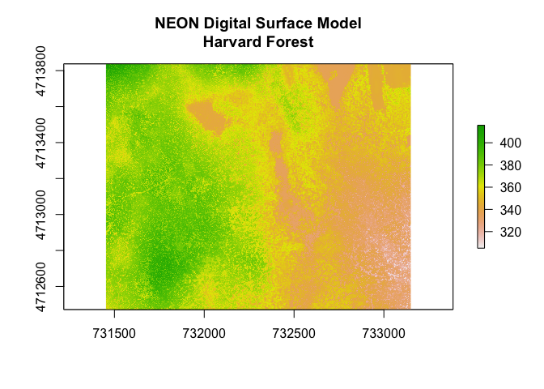
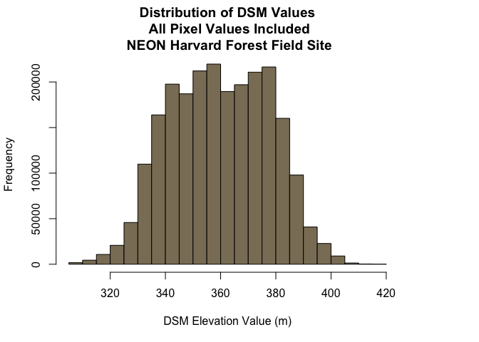
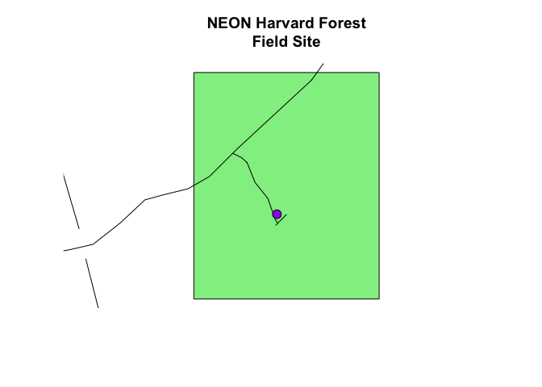
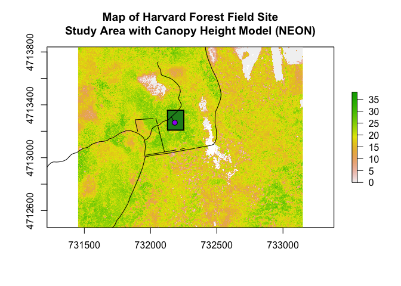

Spatial Data & R
================
Ryan Peek
Updated: 2017-03-06

Libraries Required:
-------------------

Let's look at the libraries we'll need for this lesson.

``` r
library(rgdal)  # for vector work; sp package will load with rgdal
```

    ## Loading required package: sp

    ## rgdal: version: 1.2-5, (SVN revision 648)
    ##  Geospatial Data Abstraction Library extensions to R successfully loaded
    ##  Loaded GDAL runtime: GDAL 2.1.2, released 2016/10/24
    ##  Path to GDAL shared files: /usr/local/share/gdal
    ##  Loaded PROJ.4 runtime: Rel. 4.9.1, 04 March 2015, [PJ_VERSION: 491]
    ##  Path to PROJ.4 shared files: (autodetected)
    ##  Linking to sp version: 1.2-3

``` r
library(raster) # for metadata/attributes- vectors or rasters
library(leaflet) # interactive maps
library(readr) # reading stuff
library(dplyr) # doing stuff
```

    ## 
    ## Attaching package: 'dplyr'

    ## The following objects are masked from 'package:raster':
    ## 
    ##     intersect, select, union

    ## The following objects are masked from 'package:stats':
    ## 
    ##     filter, lag

    ## The following object is masked from '.env':
    ## 
    ##     n

    ## The following objects are masked from 'package:base':
    ## 
    ##     intersect, setdiff, setequal, union

``` r
library(viridis) # color palettes
```

Coordinate Reference Systems (CRS)
----------------------------------

How to “flatten” or project the spatial data in geographic space. Often called projection, this can be a tricky business if you don't know or have a specific projection/CRS for your data, or when trying to mix two different CRS at once.

Best is to use some standards, and transform all projections into the same CRS before you work/plot your data.

Check this for more: - CRS Projections: <http://spatialreference.org/ref/epsg/> - Choosing the Right Projection: <https://source.opennews.org/articles/choosing-right-map-projection/>

``` r
# set strings for UTMs and lats for commonly used projections (WGS84)
utms <- CRS("+init=epsg:32610") ## more detailed def using the EPSG code
lats <-CRS("+init=epsg:4326") # set the default for lat/longs, plays well with leaflet and google
```

Get NEON Data
-------------

First we went and downloaded the [NEON Shapefile](https://ndownloader.figshare.com/files/3708751) data, which downloads as a *.zip* file. You'll need to double click on that file to unzip it (if on Mac), or try right clicking on the zip file and look for an unzip option. Make note of *where* the unzipped folder ends up. In my case I made a **`GIS`** folder and then unzipped it there.

### RASTER Data

``` r
DSM_HARV <- raster("data/GIS/NEON-DS-Airborne-Remote-Sensing/HARV/DSM/HARV_dsmCrop.tif")

DSM_HARV # view the data
```

    ## class       : RasterLayer 
    ## dimensions  : 1367, 1697, 2319799  (nrow, ncol, ncell)
    ## resolution  : 1, 1  (x, y)
    ## extent      : 731453, 733150, 4712471, 4713838  (xmin, xmax, ymin, ymax)
    ## coord. ref. : +proj=utm +zone=18 +datum=WGS84 +units=m +no_defs +ellps=WGS84 +towgs84=0,0,0 
    ## data source : /Users/ryanpeek/Documents/github/teaching/wRangling_Lectures/data/GIS/NEON-DS-Airborne-Remote-Sensing/HARV/DSM/HARV_dsmCrop.tif 
    ## names       : HARV_dsmCrop 
    ## values      : 305.07, 416.07  (min, max)

``` r
plot(DSM_HARV, 
     main="NEON Digital Surface Model\nHarvard Forest")
```



``` r
crs(DSM_HARV)
```

    ## CRS arguments:
    ##  +proj=utm +zone=18 +datum=WGS84 +units=m +no_defs +ellps=WGS84
    ## +towgs84=0,0,0

``` r
# assign crs to an object (class) to use for reprojection and other tasks
utmZ18 <- crs(DSM_HARV)
utmZ18
```

    ## CRS arguments:
    ##  +proj=utm +zone=18 +datum=WGS84 +units=m +no_defs +ellps=WGS84
    ## +towgs84=0,0,0

``` r
minValue(DSM_HARV)
```

    ## [1] 305.07

``` r
maxValue(DSM_HARV)
```

    ## [1] 416.07

``` r
hist(DSM_HARV,
     main="Distribution of Digital Surface Model Values\n Histogram Default: 100,000 pixels\n NEON Harvard Forest",
     xlab="DSM Elevation Value (m)",
     ylab="Frequency",
     col="wheat")
```

    ## Warning in .hist1(x, maxpixels = maxpixels, main = main, plot = plot, ...):
    ## 4% of the raster cells were used. 100000 values used.


``` r
# notice warning...just telling us there were a lot of pixels not plotted
ncell(DSM_HARV)
```

    ## [1] 2319799

``` r
# create histogram that includes with all pixel values in the raster
hist(DSM_HARV, 
     maxpixels=ncell(DSM_HARV),
     main="Distribution of DSM Values\n All Pixel Values Included\n NEON Harvard Forest Field Site",
     xlab="DSM Elevation Value (m)",
     ylab="Frequency",
     col="wheat4")
```



``` r
# nlayers(DSM_HARV) # number of bands or layers
# GDALinfo("data/GIS/NEON-DS-Airborne-Remote-Sensing/HARV/DSM/HARV_dsmCrop.tif")
```

### VECTOR Data

``` r
aoiBoundary_HARV <- readOGR(dsn = "data/GIS/NEON-DS-Site-Layout-Files/HARV",
                            layer = "HarClip_UTMZ18")
```

    ## OGR data source with driver: ESRI Shapefile 
    ## Source: "data/GIS/NEON-DS-Site-Layout-Files/HARV", layer: "HarClip_UTMZ18"
    ## with 1 features
    ## It has 1 fields
    ## Integer64 fields read as strings:  id

``` r
crs(aoiBoundary_HARV)
```

    ## CRS arguments:
    ##  +proj=utm +zone=18 +datum=WGS84 +units=m +no_defs +ellps=WGS84
    ## +towgs84=0,0,0

``` r
extent(aoiBoundary_HARV)
```

    ## class       : Extent 
    ## xmin        : 732128 
    ## xmax        : 732251.1 
    ## ymin        : 4713209 
    ## ymax        : 4713359

``` r
lats # notice the differences?
```

    ## CRS arguments:
    ##  +init=epsg:4326 +proj=longlat +datum=WGS84 +no_defs +ellps=WGS84
    ## +towgs84=0,0,0

``` r
utms # notice the differences?
```

    ## CRS arguments:
    ##  +init=epsg:32610 +proj=utm +zone=10 +datum=WGS84 +units=m +no_defs
    ## +ellps=WGS84 +towgs84=0,0,0

``` r
# access things in a spatial_BLANK_Dataframe with object_name@data
```

``` r
plot(aoiBoundary_HARV, col="cyan1", border="black", lwd=3,
     main="AOI Boundary Plot")
```


#### CHALLENGE 1: Import More Data!

-   Get `HARV_roads` and `HARVtower_UTM18N` layers into R. Call the `Harv_roads` object **`lines_HARV`** and the `HARVtower_UTM18N` `**point_HARV**`.

<!-- -->

    ## OGR data source with driver: ESRI Shapefile 
    ## Source: "data/GIS/NEON-DS-Site-Layout-Files/HARV/HarClip_UTMZ18.shp", layer: "HarClip_UTMZ18"
    ## with 1 features
    ## It has 1 fields
    ## Integer64 fields read as strings:  id

    ## OGR data source with driver: ESRI Shapefile 
    ## Source: "data/GIS/NEON-DS-Site-Layout-Files/HARV", layer: "HarClip_UTMZ18"
    ## with 1 features
    ## It has 1 fields
    ## Integer64 fields read as strings:  id

    ## OGR data source with driver: ESRI Shapefile 
    ## Source: "data/GIS/NEON-DS-Site-Layout-Files/HARV", layer: "HARV_roads"
    ## with 13 features
    ## It has 15 fields

    ## OGR data source with driver: ESRI Shapefile 
    ## Source: "data/GIS/NEON-DS-Site-Layout-Files/HARV", layer: "HARVtower_UTM18N"
    ## with 1 features
    ## It has 14 fields



    ## class       : Extent 
    ## xmin        : 730741.2 
    ## xmax        : 733295.5 
    ## ymin        : 4711942 
    ## ymax        : 4714260

    ## class       : Extent 
    ## xmin        : 732128 
    ## xmax        : 732251.1 
    ## ymin        : 4713209 
    ## ymax        : 4713359

#### CHALLENGE 2: Mix Vectors and Rasters

    ## OGR data source with driver: ESRI Shapefile 
    ## Source: "data/GIS/NEON-DS-Site-Layout-Files/HARV", layer: "HarClip_UTMZ18"
    ## with 1 features
    ## It has 1 fields
    ## Integer64 fields read as strings:  id

    ## OGR data source with driver: ESRI Shapefile 
    ## Source: "data/GIS/NEON-DS-Site-Layout-Files/HARV", layer: "HARV_roads"
    ## with 13 features
    ## It has 15 fields

    ## OGR data source with driver: ESRI Shapefile 
    ## Source: "data/GIS/NEON-DS-Site-Layout-Files/HARV", layer: "HARVtower_UTM18N"
    ## with 1 features
    ## It has 14 fields



Some other Tricks?
------------------

These are newish packages that you might find useful for GIS analysis, mapping ,etc.

I'll talk about the `**leaflet**` package in particular, but there are many other spatial packages in R which may be useful.

``` r
#devtools::install_github('walkerke/tigris')
library(tigris)

ua <- urban_areas(cb = TRUE) # Basic US urbanized areas data
us_geo <- states(class = "sf") # simplified feature of STATES

library(ggmap)
library(ggvis)
library(leaflet)
library(ggsn) # for scale bars/north arrows in ggplots
```

Your Data!
----------

Let's take a look at some of your stuff (thanks Ann and Tom!).

### Get CSV with XY data

``` r
library(dplyr)
library(rgdal)
library(raster)

# NOTE: I removed using the `readr` package here because it was causing problems when trying to 
# write the shapefile later in this script. Use read.csv instead.

# read straight from a URL
edna <- read.csv(file ="https://raw.githubusercontent.com/gge-ucd/wRangling_Seminar/master/data/GIS/eDNA_stations_19Feb2017_fixedc.csv")

# edna <- read.csv("data/GIS/eDNA_stations_19Feb2017_fixedc.csv")

# Check how many NA's in spatial data
edna %>% filter(is.na(lat)) %>% tally # no NAs!
```

    ##   n
    ## 1 0

``` r
# make the data "spatial":
edna.SP <- SpatialPointsDataFrame(coords = edna[, c("lon","lat")], data = edna)

# check the CRS
raster::crs(edna.SP) # should be NA
```

    ## CRS arguments: NA

``` r
# add the projection:
lats <-CRS("+init=epsg:4326") # set the default for lat/longs

proj4string(edna.SP) <- lats # assign the CRS we want to use

raster::crs(edna.SP) # should be the full lats obj now
```

    ## CRS arguments:
    ##  +init=epsg:4326 +proj=longlat +datum=WGS84 +no_defs +ellps=WGS84
    ## +towgs84=0,0,0

``` r
# Transform to UTMs (or whatever)

utms <- CRS("+init=epsg:32610") # zone 10 UTMs

edna_utms.SP<-spTransform(x = edna.SP, CRSobj = utms)
crs(edna_utms.SP) # should be the full UTMs now
```

    ## CRS arguments:
    ##  +init=epsg:32610 +proj=utm +zone=10 +datum=WGS84 +units=m +no_defs
    ## +ellps=WGS84 +towgs84=0,0,0

``` r
# add UTMs as cols to dataframe?
edna.SP@data$utm_y <- edna_utms.SP@coords[,1]
edna.SP@data$utm_x <- edna_utms.SP@coords[,2]
```

### Save Data as Shapefile, KML, CSV

``` r
# WRITING SHPs --------------------

# unfortunately, ESRI (ArcGIS) has a 10 character limit on column names
# in addition there can't be any special characters (including "-"). Underscores are ok.

# so easiest workaround to ensure you know the shapefile will write is to shorten
# your field names in advance (or change them as you need).

# rename cols with > 10 characters so they'll be unique
names(edna.SP)[1:3]<-c("coll_yr","coll_mon","coll_day")

# shorten/trim all cols to 10 digits
names(edna.SP) <- strtrim(names(edna.SP),10)

writeOGR(edna.SP, dsn="data/GIS", layer="edna",  driver="ESRI Shapefile")

# OPENING A SHP IN GOOGLE EARTH PRO -------------------------

# REALLY COOL INSIDE TIP: Download Google Earth Pro:
# http://www.google.com/intl/en/earth/download/gep/agree.html
# The license key once you download it is "GEPFREE"

# You can open a shapefile in google earth pro, and all the attributes will pop up from your dataframe. 
# You can then easily save this as a KML or KMZ file to share with other folks.

# WRITING CSV FROM SPATIAL DATAFRAME ------------------------

# just access the dataframe part of your spatial * dataframe:
write_csv(edna.SP@data, path = "data/GIS/edna_sites.csv")
```

``` r
library(maps)
library(mapdata)
library(ggmap) # ggplot functionality for maps
```

    ## Loading required package: ggplot2

    ## Google Maps API Terms of Service: http://developers.google.com/maps/terms.

    ## Please cite ggmap if you use it: see citation("ggmap") for details.

``` r
#library(ggsn) # for scale bars/north arrows in ggplots

# see what extent is for our shape/points
extent(edna.SP)
```

    ## class       : Extent 
    ## xmin        : -122.0331 
    ## xmax        : -121.6897 
    ## ymin        : 38.02171 
    ## ymax        : 38.13106

``` r
# Use this in xlim/ylim
map("state",region=c('CA'), xlim = c(-122.3,-121.6), ylim=c(38,38.3))
map.axes()
map("county",region=c('CA'),boundary=FALSE,lty=3, add=TRUE)

# add the points
plot(edna.SP, add=TRUE, pch=21, bg="#FDE725FF") # all points

plot(edna.SP[edna.SP@data$tide_dir=="ebb",], add=TRUE,pch=16, cex=0.4, bg="#FDE725FF") # tide ebb points

# add a legend
legend("topright", legend = c("eDNA-flood", "eDNA-ebb"), 
             pt.bg = c("#FDE725FF"), col = "black", 
             pch = c(21))

legend("topright", legend = c("eDNA-flood", "eDNA-ebb"), col = c(NA,"black"),
             pch = c(NA, 16), bty="n", pt.cex = 0.4)
```


### Static Maps with Backgrounds

Using the `ggmap` package allows you to add background layers to your maps.

For a full example on how to do this, and how to add an inset to your map with legend and North arrows, check out something I wrote up a while back:

-   <https://ryanpeek.github.io/2016-09-28-static_maps_in_R/>

``` r
library(ggmap)
location=c(-121.95,38.1) # set the center of the map

# background
map1 <- get_map(location=location, crop = F,
                                color="bw",
                                maptype="terrain",
                                source="google",
                                zoom=10)
```

    ## Source : https://maps.googleapis.com/maps/api/staticmap?center=38.1,-121.95&zoom=10&size=640x640&scale=2&maptype=terrain&language=en-EN

``` r
sitemap <- ggmap(map1, extent = 'device') # use the BW terrain option
sitemap
```


``` r
library(ggrepel) # to add labels to your plot
# geom_label_repel() adds labels with nice white boxes
# geom_text_repel() just adds text labels, no boxes

nicemap<-
    sitemap + 
    labs(x="Longitude (WGS84)", y="Latitude") + 
    geom_point(data=edna, aes(x=lon, y=lat), pch=21, size=2.4,
               color='black',
               fill="#2A788EFF", alpha=0.9) + 
    # geom_label_repel(data=edna, 
    #                  aes(x=lon, y=lat, label=Station),
    #                    nudge_y=0.01, size=3, fontface = "bold.italic",
    #                    label.r=unit(0.10, "lines"))+
    theme_bw()+
    theme(panel.border = element_rect(colour = "black", fill=NA, size=1))

nicemap
```


``` r
# save your map:
#ggsave(filename = "documents/edna_site_map.pdf", width = 6, height = 6, units = "in", dpi = 300)
```

### Leaflet

Check out the interactive power of leaflet maps. They are great, fun to play with, and a great way to share data.

-   Leaflet in R: <https://rstudio.github.io/leaflet/>

``` r
library(leaflet)

m <- leaflet() %>% addTiles() %>% 
  setView(lng = -121.95, lat = 38.1, zoom = 8) %>%  # zoom 5 for all CA 
  #addTiles(group = "OSM") %>%
  addProviderTiles("Stamen.TopOSMFeatures", group = "OSM Features") %>%
  addProviderTiles("Esri.WorldImagery", group = "ESRI Aerial") %>%
  addProviderTiles("Esri.WorldTopoMap", group = "ESRI Topo") %>%
    addProviderTiles("OpenStreetMap.BlackAndWhite", group = "B&W") %>%
    addProviderTiles("Stamen.TonerLite", group = "StamenT1") %>%
    addProviderTiles("Stamen.Watercolor", group = "StamenT2") %>%
    #addProviderTiles("Thunderforest.Landscape", group = "Topo") %>%
  hideGroup("OSM Features") %>% # busy layer so hide initially
  
    # other map layers:
    # Stamen.Toner
    # Stamen.TonerLite
    # Stamen.Watercolor
    
  # eDNA sites 
  addCircleMarkers(data=edna.SP, group="eDNA",
                                 popup=paste0("Station: ", edna.SP@data$Station, "<br>",
                                                         "Month: ", edna.SP@data$collection_month, 
                                                         "<br>","Tide: ",edna.SP@data$tide_dir,
                                                         "<br>", "Trawl Type: ",edna.SP@data$trawl_type,
                                                         "<br>", "Turbidity: ", edna.SP@data$turb),
                   stroke=TRUE, weight=0.6,radius=10,
                   fillOpacity = 0.8, color="black",
                   fillColor = "yellow") %>%

    # eDNA from dataframe  
  addCircleMarkers(data=edna.SP, group="eDNA_df",
                   lng = ~lon, lat = ~lat,  # has to be decimal degrees WGS84
                   radius = 6,
                                 popup=paste0("Station: ", edna$Station, "<br>",
                                                         "Month: ", edna$collection_month, 
                                                         "<br>","Tide: ",edna$tide_dir,
                                                         "<br>", "Trawl Type: ",edna$trawl_type,
                                                         "<br>", "Turbidity: ", edna$turb),
                   fillColor = ~ifelse(edna$tide_dir=="flood","darkblue", "red"),
                                 stroke=TRUE, weight=0.6,
                   fillOpacity = 0.8) %>%

  hideGroup("eDNA_df") %>%
        
# add a legend for points
  addLegend("bottomright", colors = c("darkblue", "red"),
            labels=c("Flood", "Ebb"),
            title = "Tidal Direction",
            opacity = 0.7) %>%

  # add controls for basemaps and data
  addLayersControl(
    baseGroups = c("OSM", "B&W", "StamenT1", "StamenT2", "ESRI Topo", "ESRI Aerial"),
    overlayGroups = c("eDNA","eDNA_df", "OSM Features"),
    options = layersControlOptions(collapsed = T))

m
```


When you want to save this leaflet map and share it, you'll need the **`htmlwidgets`** package. Bear in mind when you save these maps (particularly with lots of points or layers) as `.html`, they can be quite large in size (i.e., &gt;10-100sMBs).

``` r
library(htmlwidgets)
saveWidget(widget = m, file="documents/eDNA_site_map.html", selfcontained = FALSE)
```
