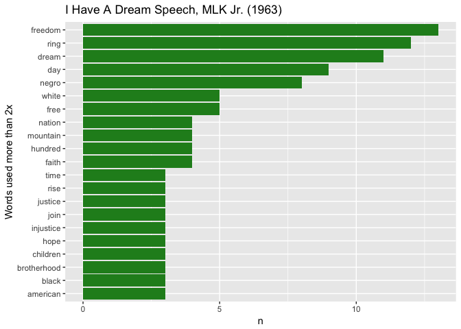

Tidy Text
================
Ryan Peek
Updated: 2017-01-16

Using Tidy Text
---------------

Let's learn about doing text mining...check out here: <http://tidytextmining.com/tidytext.html> for more details.

``` r
library(dplyr, warn.conflicts = F)
library(tidytext)

text <- c("Because I could not stop for Death -",
          "He kindly stopped for me -",
          "The Carriage held but just Ourselves -",
          "and Immortality")

text_df <- data_frame(line = 1:4, text = text)

text_df %>%
  unnest_tokens(word, text)
```

    ## # A tibble: 20 × 2
    ##     line        word
    ##    <int>       <chr>
    ## 1      1     because
    ## 2      1           i
    ## 3      1       could
    ## 4      1         not
    ## 5      1        stop
    ## 6      1         for
    ## 7      1       death
    ## 8      2          he
    ## 9      2      kindly
    ## 10     2     stopped
    ## 11     2         for
    ## 12     2          me
    ## 13     3         the
    ## 14     3    carriage
    ## 15     3        held
    ## 16     3         but
    ## 17     3        just
    ## 18     3   ourselves
    ## 19     4         and
    ## 20     4 immortality

To play around with something, I took Martin Luther King Jr.'s "*I Have A Dream*" and we will see what the most commonly used words are.

``` r
library(readr)
library(ggplot2)

mlk<-read_lines("data/I_have_a_dream_1963.md")

mlk_text <- data_frame(line = 1:length(mlk), text = mlk)

# filter blank lines (even rows)
mlk_text <- mlk_text %>% filter(line %% 2 == 1) %>% 
  mutate(line = 1:nrow(.)) # renumber lines

# Make single word vector
mlk_text<- mlk_text %>%
  unnest_tokens(word, text)

# Now join with stop words
tidy_mlk <- mlk_text %>%
  anti_join(stop_words)
```

    ## Joining, by = "word"

``` r
tidy_mlk %>%
  count(word, sort = TRUE) 
```

    ## # A tibble: 214 × 2
    ##        word     n
    ##       <chr> <int>
    ## 1   freedom    13
    ## 2      ring    12
    ## 3     dream    11
    ## 4       day     9
    ## 5     negro     8
    ## 6      free     5
    ## 7     white     5
    ## 8     faith     4
    ## 9   hundred     4
    ## 10 mountain     4
    ## # ... with 204 more rows

``` r
tidy_mlk %>%
  count(word, sort = TRUE) %>%
  filter(n > 2) %>%
  mutate(word = reorder(word, n)) %>%
  ggplot(aes(word, n)) +
  geom_bar(stat = "identity", fill="forestgreen") +
  xlab(NULL) +
  coord_flip()
```


