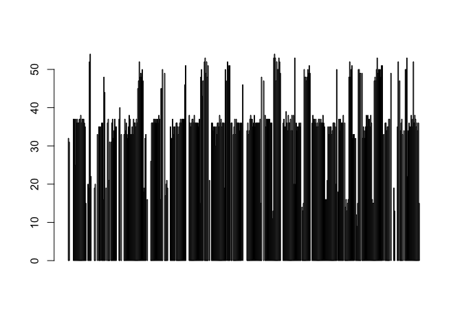

# ECL290 w**R**angling Notebook
Ryan Peek  
Updated: `r format(Sys.Date())`  


This is an R Markdown document. Markdown is a simple formatting syntax for authoring HTML, PDF, and MS Word documents. For more details on using R Markdown see <http://rmarkdown.rstudio.com>.

 - _**This is where I will save the live scripting we do in class:**_
    - Here's the link:  __[Rmd script](https://dl.dropboxusercontent.com/u/108583959/wRangling_notebook.Rmd)__
 - Also, if you have questions or feedback, we'll be referring to this website throughout the class:
    - https://gge-ucd.github.io/wRangling-Ecology/
 - And finally, for instant in-class feedback, please use this Google Survey Form whenever you see a <i class="fa fa-bolt fa-3x" aria-hidden="true"></i>:
    - https://gge-ucd.github.io/wRangling-Ecology/in-class-feedback/

# WEEK 1

## Using Github & RStudio

The goal is to introduce you to R, RStudio, and how they function with github. We will probably cover a lot more than you can absorb, but mainly I hope to familiarize you to the landscape and tools, and then you'll begin to recognize the pieces as we start using them more regularly.

### RStudio Preferences <i class="fa fa-cog" aria-hidden="true"></i>

*<sub>What! You can use Icons?! More on that later...</sub>*

RStudio has a seemingly infinite number of combinations and settings, don't let it scare you! Ultimately you only need adjust what you need/use, and as you become more savvy you can begin changing more options.

 - Try looking at the `Tools > Global Options`
    - Where is your default R directory? <i class="fa fa-check-square" aria-hidden="true"></i>
    - Unclick "Restore .RData into workspace at startup" <i class="fa fa-check-square" aria-hidden="true"></i>
    - Look on the left hand side for Pane Layout...adjust to your preference


### RMarkdown Documents  <i class="fa fa-file-text" aria-hidden="true"></i>

You can customize these to your heart's content. Many options, styles, etc. What's really neat is you can create slide presentations, apps, reports, even books, using RMarkdown documents. The only thing that gets changed around (for the most part) is the `yaml` header at the top (the section delineated with a `---` at the start and end). So once you learn some basics, you can do a lot!

 > See here for more info: (http://rmarkdown.rstudio.com/index.html)
 
The lines at the top of this *Rmd* file are setting the global code chunk options. If you want, you could load packages here, but probably not advised because the setup chunk won't show up in the document (it's hidden using `include=FALSE`).


```r
knitr::opts_chunk$set(echo = FALSE, warning=FALSE)
knitr::opts_knit$set(root.dir = normalizePath("../"))
htmltools::tagList(rmarkdown::html_dependency_font_awesome())
```

The second and third lines (`knitr::opts_knit` and `htmltools`) are doing the following.

 - `normalizePath` is a way to tell the Rmarkdown `knitr` to look for files *up* one directory, assuming your Rmd is saved in a documents folder inside the root directory.
 - `htmltools` is just a fun tool to add little graphic icons (like this <i class="fa fa-fire" aria-hidden="true"></i>).

# WEEK 2:

## Using lists or vectors of characters


```r
# Entering Data Objects ---------------------------------------------------

weight_kg <- 55    # doesn't print anything
(weight_kg <- 55)  # but putting parenthesis around the call prints the value of `weight_kg`
```

```
## [1] 55
```

```r
weight_kg          # and so does typing the name of the object
```

```
## [1] 55
```

```r
weight_kg <- 57.5

2.2 * weight_kg
```

```
## [1] 126.5
```

```r
weight_lb <- 2.2 * weight_kg

weight_kg <- 100

# Vectors & Datatypes -----------------------------------------------------

# numeric

weight_g <- c(50, 60, 65, 82)
weight_g
```

```
## [1] 50 60 65 82
```

```r
summary(weight_g)
```

```
##    Min. 1st Qu.  Median    Mean 3rd Qu.    Max. 
##   50.00   57.50   62.50   64.25   69.25   82.00
```

```r
# character

## THIS WON'T WORK:
# 1animals <- c("mouse", "rat", "dog", "cat") # can't start variable name with a number

animals <- c("mouse", "rat", "dog", "cat") # can't start variable name with a number
summary(animals)
```

```
##    Length     Class      Mode 
##         4 character character
```

```r
# factors
named_variable <- as.factor(c("mouse", "rat", "dog", "cat"))

# Looking at our data
str(named_variable)
```

```
##  Factor w/ 4 levels "cat","dog","mouse",..: 3 4 2 1
```

```r
class(named_variable)
```

```
## [1] "factor"
```

```r
summary(named_variable)
```

```
##   cat   dog mouse   rat 
##     1     1     1     1
```

```r
weight_g <- c(weight_g, 90) # adding at the end of the vector
weight_g <- c(30, weight_g) # adding at the beginning of the vector
weight_g
```

```
## [1] 30 50 60 65 82 90
```

```r
# Data Classes ------------------------------------------------------------

# What will these be?
num_char <- c(1, 2, 3, 'a') # character wins over numeric


num_logical <- c(1, 2, 3, FALSE)
char_logical <- c('a', 'b', 'c', TRUE)
tricky <- c(1, 2, 3, '4')


# Subsetting --------------------------------------------------------------

animals <- c("mouse", "rat", "dog", "cat")

animals[ c(1, 2:4, 4) ]
```

```
## [1] "mouse" "rat"   "dog"   "cat"   "cat"
```

```r
named_variable[2]
```

```
## [1] rat
## Levels: cat dog mouse rat
```

```r
weight_g[4]
```

```
## [1] 65
```

```r
# Conditional subsetting
weight_g <- c(21, 34, 39, 54, 55)
weight_g[c(TRUE, FALSE, TRUE, TRUE, FALSE)]
```

```
## [1] 21 39 54
```

```r
weight_g > 50    # will return logicals with TRUE for the indices that meet the condition
```

```
## [1] FALSE FALSE FALSE  TRUE  TRUE
```

```r
## so we can use this to select only the values above 50
weight_g[weight_g > 50]
```

```
## [1] 54 55
```

```r
## Combine with using & (AND) or | (OR)
weight_g[weight_g < 30 | weight_g > 50]
```

```
## [1] 21 54 55
```

```r
weight_g[weight_g < 30 & weight_g > 50]
```

```
## numeric(0)
```

```r
weight_g[weight_g >= 30 | weight_g == 21]
```

```
## [1] 21 34 39 54 55
```

```r
# ADVANCED Subsetting -----------------------------------------------------

animals <- c("mouse", "rat", "dog", "cat")
animals[animals == "cat" | animals == "rat"] # returns both rat and cat
```

```
## [1] "rat" "cat"
```

```r
# tedious typing...so let's try the function %in%

animals %in% c("rat", "cat", "dog", "duck")
```

```
## [1] FALSE  TRUE  TRUE  TRUE
```

```r
animals[animals %in% c("rat", "cat", "dog", "duck")]
```

```
## [1] "rat" "dog" "cat"
```

```r
## Challenge: Why does "four" > "five" returns TRUE?

# Missing Data and NA -----------------------------------------------------

planets <- c("Mercury", "Venus", "Earth", "Mars", "Jupiter", "Saturn", "Uranus", "Neptune", NA)

heights <- c(2, 4, 4, NA, 6)

mean(heights)
```

```
## [1] NA
```

```r
max(heights)
```

```
## [1] NA
```

```r
mean(heights, na.rm = TRUE)
```

```
## [1] 4
```

```r
max(heights, na.rm = TRUE)
```

```
## [1] 6
```

```r
# extract elements that are not missing values
heights[ !is.na(heights) ]
```

```
## [1] 2 4 4 6
```

```r
# make a new vector with no NAs 
planet_no_NA <- planets[ !is.na(planets)]

# using function na.omit:
na.omit(heights)
```

```
## [1] 2 4 4 6
## attr(,"na.action")
## [1] 4
## attr(,"class")
## [1] "omit"
```

```r
# extract elements that are complete cases
heights[complete.cases(heights)]
```

```
## [1] 2 4 4 6
```

```r
## Challenge

sample <- c(2, 4, 4, "NA", 6)
mean(sample, na.rm = TRUE)
```

```
## [1] NA
```

```r
# so we need to convert to numeric:
sample_num <- as.numeric(sample)
mean(sample_num, na.rm = TRUE)
```

```
## [1] 4
```


```r
# Make a vector of names
firstnames <- c("Ryan", "Sue", "John", "Rachel")
firstnames
```

```
## [1] "Ryan"   "Sue"    "John"   "Rachel"
```

```r
str(firstnames)  # tells you structure of data
```

```
##  chr [1:4] "Ryan" "Sue" "John" "Rachel"
```

```r
# make a vector of animals
animals <- c('cat', "dog", 'rat', 'mouse')
animals
```

```
## [1] "cat"   "dog"   "rat"   "mouse"
```

```r
# combine vectors
biglist <- c(firstnames, animals)

biglist
```

```
## [1] "Ryan"   "Sue"    "John"   "Rachel" "cat"    "dog"    "rat"    "mouse"
```

```r
# Make a vector of numbers

lista <- c(1, 2, 5, 8, 11, NA, 15)
lista
```

```
## [1]  1  2  5  8 11 NA 15
```

```r
str(lista)
```

```
##  num [1:7] 1 2 5 8 11 NA 15
```

```r
# find out length of vector
length(lista)
```

```
## [1] 7
```

```r
# summarizes data based on type
summary(lista)
```

```
##    Min. 1st Qu.  Median    Mean 3rd Qu.    Max.    NA's 
##    1.00    2.75    6.50    7.00   10.25   15.00       1
```

```r
summary(biglist)
```

```
##    Length     Class      Mode 
##         8 character character
```

```r
# A function
mean(x=lista, na.rm = TRUE) # remember you can use tab to autocomplete
```

```
## [1] 7
```

```r
# Working with NAs --------------------------------------------------------

is.na(lista) #TRUE/FALSE list of all NAs
```

```
## [1] FALSE FALSE FALSE FALSE FALSE  TRUE FALSE
```

```r
lista[6] # accessing 6 item in the vector
```

```
## [1] NA
```

```r
lista_noNA <- lista[!is.na(lista)]

length(lista_noNA)
```

```
## [1] 6
```

```r
lista[6] <- 0
lista
```

```
## [1]  1  2  5  8 11  0 15
```

```r
rm(lista_noNA) # remove this object from your environment

# Sequence ---------------------------------------------------------------

seq(1,10, by=1)
```

```
##  [1]  1  2  3  4  5  6  7  8  9 10
```

```r
seq(5,10, length.out = 3) # it calculates values of breaks/intervals for you
```

```
## [1]  5.0  7.5 10.0
```

```r
seq(1, 8, by=3)
```

```
## [1] 1 4 7
```

```r
oneK<-seq(1000, 34000, by=1000)

# can use this to subset to the 1000, 2000 ... rows
# DATA[oneK,] 
```

A few notes, remember to assign objects (these can be lists, vectors, dataframe, functions) to your environment using `<-`.

Where possible, comment liberally. Also for clean coding a few tips:  

 - add spaces between assignments
 - after commas
 - never before parantheses or brackets


## Reading in some data and exploring dataframes

So we've worked with single "lists" or "vectors" of data above. If we chain those together we can create a dataframe, which is a rectangular vector with rows and columns. 


```r
# Reading in Data ---------------------------------------------------------

#download.file(url = "https://ndownloader.figshare.com/files/2292169", destfile = "data/portal_data_joined.csv")

# make sure you look at where the "destfile" path is, that's where file goes.

# read in the csv file, notice the relative path
surveys <- read.csv('data/portal_data_joined.csv')

# look at the top/bottom lines of the data
head(surveys)
```

```
TRUE   record_id month day year plot_id species_id sex hindfoot_length weight
TRUE 1         1     7  16 1977       2         NL   M              32     NA
TRUE 2        72     8  19 1977       2         NL   M              31     NA
TRUE 3       224     9  13 1977       2         NL                  NA     NA
TRUE 4       266    10  16 1977       2         NL                  NA     NA
TRUE 5       349    11  12 1977       2         NL                  NA     NA
TRUE 6       363    11  12 1977       2         NL                  NA     NA
TRUE     genus  species   taxa plot_type
TRUE 1 Neotoma albigula Rodent   Control
TRUE 2 Neotoma albigula Rodent   Control
TRUE 3 Neotoma albigula Rodent   Control
TRUE 4 Neotoma albigula Rodent   Control
TRUE 5 Neotoma albigula Rodent   Control
TRUE 6 Neotoma albigula Rodent   Control
```

```r
tail(surveys)
```

```
TRUE       record_id month day year plot_id species_id sex hindfoot_length
TRUE 34781     26787     9  27 1997       7         PL   F              21
TRUE 34782     26966    10  25 1997       7         PL   M              20
TRUE 34783     27185    11  22 1997       7         PL   F              21
TRUE 34784     27792     5   2 1998       7         PL   F              20
TRUE 34785     28806    11  21 1998       7         PX                  NA
TRUE 34786     30986     7   1 2000       7         PX                  NA
TRUE       weight       genus  species   taxa        plot_type
TRUE 34781     16  Peromyscus leucopus Rodent Rodent Exclosure
TRUE 34782     16  Peromyscus leucopus Rodent Rodent Exclosure
TRUE 34783     22  Peromyscus leucopus Rodent Rodent Exclosure
TRUE 34784      8  Peromyscus leucopus Rodent Rodent Exclosure
TRUE 34785     NA Chaetodipus      sp. Rodent Rodent Exclosure
TRUE 34786     NA Chaetodipus      sp. Rodent Rodent Exclosure
```

```r
summary(surveys) # look at summary of data
```

```
TRUE    record_id         month             day            year     
TRUE  Min.   :    1   Min.   : 1.000   Min.   : 1.0   Min.   :1977  
TRUE  1st Qu.: 8964   1st Qu.: 4.000   1st Qu.: 9.0   1st Qu.:1984  
TRUE  Median :17762   Median : 6.000   Median :16.0   Median :1990  
TRUE  Mean   :17804   Mean   : 6.474   Mean   :16.1   Mean   :1990  
TRUE  3rd Qu.:26655   3rd Qu.:10.000   3rd Qu.:23.0   3rd Qu.:1997  
TRUE  Max.   :35548   Max.   :12.000   Max.   :31.0   Max.   :2002  
TRUE                                                                
TRUE     plot_id        species_id    sex       hindfoot_length
TRUE  Min.   : 1.00   DM     :10596    : 1748   Min.   : 2.00  
TRUE  1st Qu.: 5.00   PP     : 3123   F:15690   1st Qu.:21.00  
TRUE  Median :11.00   DO     : 3027   M:17348   Median :32.00  
TRUE  Mean   :11.34   PB     : 2891             Mean   :29.29  
TRUE  3rd Qu.:17.00   RM     : 2609             3rd Qu.:36.00  
TRUE  Max.   :24.00   DS     : 2504             Max.   :70.00  
TRUE                  (Other):10036             NA's   :3348   
TRUE      weight                   genus               species     
TRUE  Min.   :  4.00   Dipodomys      :16167   merriami    :10596  
TRUE  1st Qu.: 20.00   Chaetodipus    : 6029   penicillatus: 3123  
TRUE  Median : 37.00   Onychomys      : 3267   ordii       : 3027  
TRUE  Mean   : 42.67   Reithrodontomys: 2694   baileyi     : 2891  
TRUE  3rd Qu.: 48.00   Peromyscus     : 2234   megalotis   : 2609  
TRUE  Max.   :280.00   Perognathus    : 1629   spectabilis : 2504  
TRUE  NA's   :2503     (Other)        : 2766   (Other)     :10036  
TRUE       taxa                           plot_type    
TRUE  Bird   :  450   Control                  :15611  
TRUE  Rabbit :   75   Long-term Krat Exclosure : 5118  
TRUE  Reptile:   14   Rodent Exclosure         : 4233  
TRUE  Rodent :34247   Short-term Krat Exclosure: 5906  
TRUE                  Spectab exclosure        : 3918  
TRUE                                                   
TRUE 
```

```r
str(surveys) # look at structure of data
```

```
TRUE 'data.frame':	34786 obs. of  13 variables:
TRUE  $ record_id      : int  1 72 224 266 349 363 435 506 588 661 ...
TRUE  $ month          : int  7 8 9 10 11 11 12 1 2 3 ...
TRUE  $ day            : int  16 19 13 16 12 12 10 8 18 11 ...
TRUE  $ year           : int  1977 1977 1977 1977 1977 1977 1977 1978 1978 1978 ...
TRUE  $ plot_id        : int  2 2 2 2 2 2 2 2 2 2 ...
TRUE  $ species_id     : Factor w/ 48 levels "AB","AH","AS",..: 16 16 16 16 16 16 16 16 16 16 ...
TRUE  $ sex            : Factor w/ 3 levels "","F","M": 3 3 1 1 1 1 1 1 3 1 ...
TRUE  $ hindfoot_length: int  32 31 NA NA NA NA NA NA NA NA ...
TRUE  $ weight         : int  NA NA NA NA NA NA NA NA 218 NA ...
TRUE  $ genus          : Factor w/ 26 levels "Ammodramus","Ammospermophilus",..: 13 13 13 13 13 13 13 13 13 13 ...
TRUE  $ species        : Factor w/ 40 levels "albigula","audubonii",..: 1 1 1 1 1 1 1 1 1 1 ...
TRUE  $ taxa           : Factor w/ 4 levels "Bird","Rabbit",..: 4 4 4 4 4 4 4 4 4 4 ...
TRUE  $ plot_type      : Factor w/ 5 levels "Control","Long-term Krat Exclosure",..: 1 1 1 1 1 1 1 1 1 1 ...
```

```r
# to access a single column by name within a dataframe, use the "$"
summary(surveys$species_id)
```

```
TRUE    AB    AH    AS    BA    CB    CM    CQ    CS    CT    CU    CV    DM 
TRUE   303   437     2    46    50    13    16     1     1     1     1 10596 
TRUE    DO    DS    DX    NL    OL    OT    OX    PB    PC    PE    PF    PG 
TRUE  3027  2504    40  1252  1006  2249    12  2891    39  1299  1597     8 
TRUE    PH    PI    PL    PM    PP    PU    PX    RF    RM    RO    RX    SA 
TRUE    32     9    36   899  3123     5     6    75  2609     8     2    75 
TRUE    SC    SF    SH    SO    SS    ST    SU    UL    UP    UR    US    ZL 
TRUE     1    43   147    43   248     1     5     4     8    10     4     2
```

```r
levels(surveys$species_id)
```

```
TRUE  [1] "AB" "AH" "AS" "BA" "CB" "CM" "CQ" "CS" "CT" "CU" "CV" "DM" "DO" "DS"
TRUE [15] "DX" "NL" "OL" "OT" "OX" "PB" "PC" "PE" "PF" "PG" "PH" "PI" "PL" "PM"
TRUE [29] "PP" "PU" "PX" "RF" "RM" "RO" "RX" "SA" "SC" "SF" "SH" "SO" "SS" "ST"
TRUE [43] "SU" "UL" "UP" "UR" "US" "ZL"
```

```r
# see the dimensions of the data...dataframes are listed as: row, column
dim(surveys)
```

```
TRUE [1] 34786    13
```

```r
dim(surveys)[2] # see only the total number of colummns in data
```

```
TRUE [1] 13
```

```r
# brackets allow accessing a specific row or column
surveys[10,] # only row 10, all columns (because it's blank)
```

```
TRUE    record_id month day year plot_id species_id sex hindfoot_length weight
TRUE 10       661     3  11 1978       2         NL                  NA     NA
TRUE      genus  species   taxa plot_type
TRUE 10 Neotoma albigula Rodent   Control
```

```r
summary(surveys[,4]) # pull summary of specific column
```

```
TRUE    Min. 1st Qu.  Median    Mean 3rd Qu.    Max. 
TRUE    1977    1984    1990    1990    1997    2002
```

```r
summary(surveys$year) # same as above but by name
```

```
TRUE    Min. 1st Qu.  Median    Mean 3rd Qu.    Max. 
TRUE    1977    1984    1990    1990    1997    2002
```

```r
# FILTER DATA TO A GIVEN YEAR ---------------------------------------------

# we can filter data as we like, even chaining these together.
dat1977 <- surveys[surveys$year==1977, ] # filter only rows that have year=1977.

# only rows with year==1977 AND that have hindfoot length > 30
dat_filter_example1 <- surveys[surveys$year==1977 & surveys$hindfoot_length > 30, ] 

# only rows with year==1977 OR year==1987
dat_filter_example2 <- surveys[surveys$year==1977 | surveys$year==1997, ] 

# ok, lets make a  barplotplot
barplot(height = dat1977$hindfoot_length)
```

<!-- -->

```r
# make a point plot
plot(x = dat1977$hindfoot_length, y = dat1977$weight, pch=21, bg="maroon")
```

<!-- -->

Many options for plotting parameters (changing colors, shapes, etc). Really sky is the limit. TO read more on playing with these parameters, please check out:

 - [Shapes & Parameters](http://www.statmethods.net/advgraphs/parameters.html)
 - [Colors](http://research.stowers-institute.org/efg/R/Color/Chart/)
 - [Color palettes](http://colorbrewer2.org/)

# WEEK 3

A new and very nicely put together R/Stats Book worth checking out is here:

 - https://ismayc.github.io/moderndiver-book/
 
What's great is it teaches R and how to implement R from a modeling framework, demonstrates a powerful pipeline that we all should follow. It's based in part using Hadley Wickam's R book, and the "tidyverse" of packages. We'll talk more about this next week. 


## Data Classes

Let's review the data classes we discussed previously. Remember the heirarchy of stuff in R:

 - **PACKAGES** (which are libraries of functions)
 - **_Libraries_** (collections of functions that do things)
 - *Functions* (something that takes *arguments* which use data/info)
    - DATATYPES:
        - *numeric*
        - *integer*
        - *factor*
        - *character*
        - *dates*
        - *logical/boolean (TRUE/FALSE)*


```r
# talking data classes

mixed_vector <- c(2, 4.56, TRUE)
animals <- c("cat","dog", "parrot", "frog")
animals <- as.factor(animals)

(medicine <- c("control", "a", "b", "c", "d"))
```

```
## [1] "control" "a"       "b"       "c"       "d"
```

```r
medicine <- as.factor(medicine) # way to convert to a given 


(medicine <- factor(x = c("control", "a", "b", "c", "d"), levels = c("a", "b", "c", "d", "control")))
```

```
## [1] control a       b       c       d      
## Levels: a b c d control
```

## Working With `dplyr`

Make sure you have the package installed, then load it using the `library()` function.


```r
install.packages("dplyr")
library(dplyr)

dplyr::select() # run a single function without loading a library, also helps if there's conflicting functions (i.e, same function name)
```

### 5 major verbs in dplyr: 

 - **`select`**
 - **`filter`**
 - **`mutate`**
 - **`group_by`**
 - **`summarize`**

#### Working with Select

**Challenge**:

Read in the data using `read.csv`, see how many columns, and what types of data. Name this object as "`shrubs`".


```r
library(dplyr, warn.conflicts = F)
## notice you may need to add the leading `../`
#shrubs <- read.csv("../data/shrub-volume-experiment.csv")
shrubs <- read.csv("data/shrub-volume-experiment.csv")

str(shrubs)
```

```
## 'data.frame':	12 obs. of  5 variables:
##  $ site      : int  1 1 1 2 2 2 3 3 3 4 ...
##  $ experiment: int  1 2 3 1 2 3 1 2 3 1 ...
##  $ length    : num  2.2 2.1 2.7 3 3.1 2.5 1.9 1.1 3.5 2.9 ...
##  $ width     : num  1.3 2.2 1.5 4.5 3.1 2.8 1.8 0.5 2 2.7 ...
##  $ height    : num  9.6 7.6 2.2 1.5 4 3 4.5 2.3 7.5 3.2 ...
```

```r
dim(shrubs)
```

```
## [1] 12  5
```

```r
summary(shrubs)
```

```
##       site        experiment     length          width      
##  Min.   :1.00   Min.   :1    Min.   :1.100   Min.   :0.500  
##  1st Qu.:1.75   1st Qu.:1    1st Qu.:2.050   1st Qu.:1.725  
##  Median :2.50   Median :2    Median :2.600   Median :2.100  
##  Mean   :2.50   Mean   :2    Mean   :2.558   Mean   :2.417  
##  3rd Qu.:3.25   3rd Qu.:3    3rd Qu.:3.025   3rd Qu.:2.875  
##  Max.   :4.00   Max.   :3    Max.   :4.500   Max.   :4.800  
##      height    
##  Min.   :1.50  
##  1st Qu.:2.60  
##  Median :3.60  
##  Mean   :4.55  
##  3rd Qu.:6.75  
##  Max.   :9.60
```

```r
head(shrubs)
```

```
##   site experiment length width height
## 1    1          1    2.2   1.3    9.6
## 2    1          2    2.1   2.2    7.6
## 3    1          3    2.7   1.5    2.2
## 4    2          1    3.0   4.5    1.5
## 5    2          2    3.1   3.1    4.0
## 6    2          3    2.5   2.8    3.0
```

```r
tail(shrubs)
```

```
##    site experiment length width height
## 7     3          1    1.9   1.8    4.5
## 8     3          2    1.1   0.5    2.3
## 9     3          3    3.5   2.0    7.5
## 10    4          1    2.9   2.7    3.2
## 11    4          2    4.5   4.8    6.5
## 12    4          3    1.2   1.8    2.7
```

```r
ncol(shrubs)
```

```
## [1] 5
```

```r
nrow(shrubs)
```

```
## [1] 12
```

```r
names(shrubs)
```

```
## [1] "site"       "experiment" "length"     "width"      "height"
```

```r
shrubs$site
```

```
##  [1] 1 1 1 2 2 2 3 3 3 4 4 4
```

```r
shrubs[,1]
```

```
##  [1] 1 1 1 2 2 2 3 3 3 4 4 4
```

```r
# using dplyr::select

select(shrubs, site, length)
```

```
##    site length
## 1     1    2.2
## 2     1    2.1
## 3     1    2.7
## 4     2    3.0
## 5     2    3.1
## 6     2    2.5
## 7     3    1.9
## 8     3    1.1
## 9     3    3.5
## 10    4    2.9
## 11    4    4.5
## 12    4    1.2
```

```r
select(shrubs, 1:3)
```

```
##    site experiment length
## 1     1          1    2.2
## 2     1          2    2.1
## 3     1          3    2.7
## 4     2          1    3.0
## 5     2          2    3.1
## 6     2          3    2.5
## 7     3          1    1.9
## 8     3          2    1.1
## 9     3          3    3.5
## 10    4          1    2.9
## 11    4          2    4.5
## 12    4          3    1.2
```

```r
select(shrubs, site, ends_with("h"))
```

```
##    site length width
## 1     1    2.2   1.3
## 2     1    2.1   2.2
## 3     1    2.7   1.5
## 4     2    3.0   4.5
## 5     2    3.1   3.1
## 6     2    2.5   2.8
## 7     3    1.9   1.8
## 8     3    1.1   0.5
## 9     3    3.5   2.0
## 10    4    2.9   2.7
## 11    4    4.5   4.8
## 12    4    1.2   1.8
```

```r
select(shrubs, site, contains("d"))
```

```
##    site width
## 1     1   1.3
## 2     1   2.2
## 3     1   1.5
## 4     2   4.5
## 5     2   3.1
## 6     2   2.8
## 7     3   1.8
## 8     3   0.5
## 9     3   2.0
## 10    4   2.7
## 11    4   4.8
## 12    4   1.8
```

```r
data_to_use <- select(shrubs, site, experiment, height)
write.csv(data_to_use, file = "data_output/shrub_heights.csv", row.names = FALSE)
```

### Using `filter`


```r
filter(shrubs, height > 3)
```

```
##   site experiment length width height
## 1    1          1    2.2   1.3    9.6
## 2    1          2    2.1   2.2    7.6
## 3    2          2    3.1   3.1    4.0
## 4    3          1    1.9   1.8    4.5
## 5    3          3    3.5   2.0    7.5
## 6    4          1    2.9   2.7    3.2
## 7    4          2    4.5   4.8    6.5
```

```r
filter(shrubs, width >= 2 & height > 3) # AND, must meet both conditions
```

```
##   site experiment length width height
## 1    1          2    2.1   2.2    7.6
## 2    2          2    3.1   3.1    4.0
## 3    3          3    3.5   2.0    7.5
## 4    4          1    2.9   2.7    3.2
## 5    4          2    4.5   4.8    6.5
```

```r
# using OR
filter(shrubs, width >=2 | height > 3) # OR, can match either, but not necessarily both
```

```
##   site experiment length width height
## 1    1          1    2.2   1.3    9.6
## 2    1          2    2.1   2.2    7.6
## 3    2          1    3.0   4.5    1.5
## 4    2          2    3.1   3.1    4.0
## 5    2          3    2.5   2.8    3.0
## 6    3          1    1.9   1.8    4.5
## 7    3          3    3.5   2.0    7.5
## 8    4          1    2.9   2.7    3.2
## 9    4          2    4.5   4.8    6.5
```

### Pipes **`%>%`**

`dplyr` uses a package called [`magrittr`](https://cran.r-project.org/web/packages/magrittr/vignettes/magrittr.html) which uses pipes.


```r
select(shrubs, site:width) %>% 
  filter(length > 3, width > 2) %>% 
  write.csv("data_output/demo_pipe.csv", row.names=FALSE)
```


  
